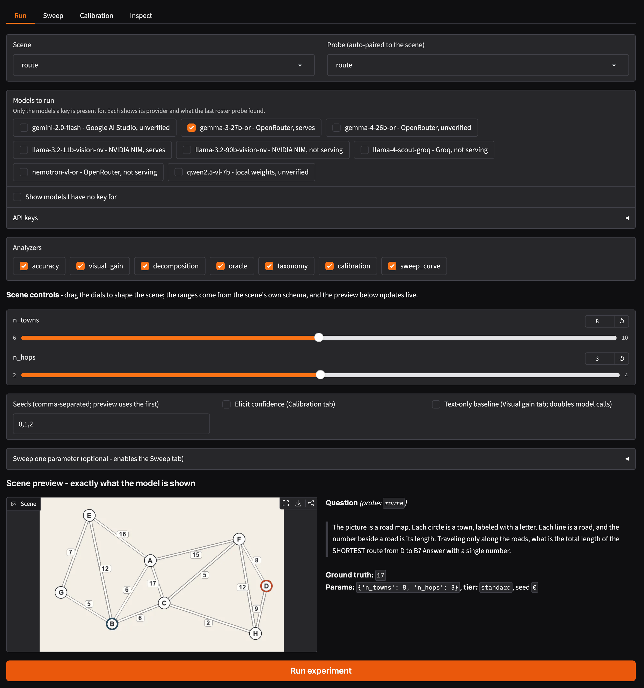
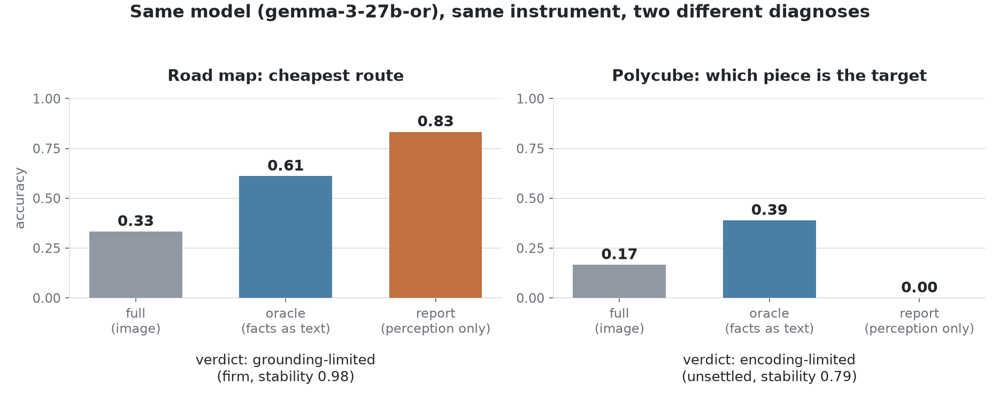
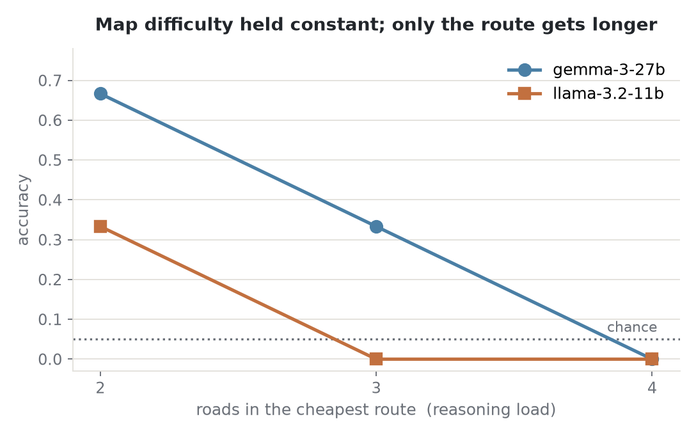
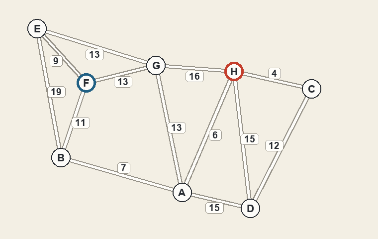
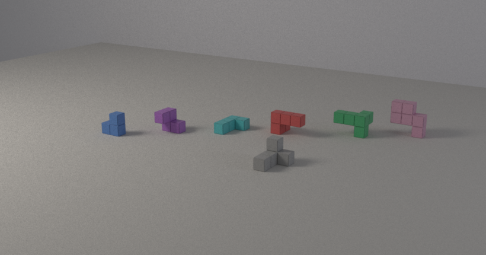
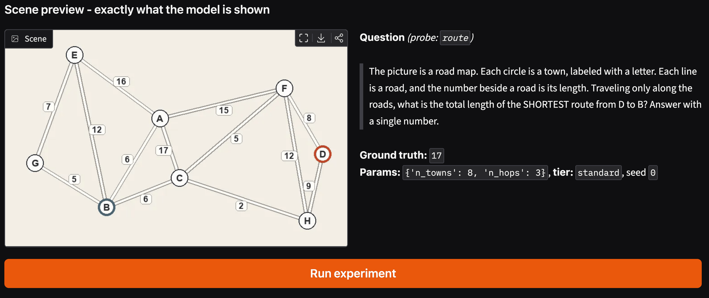
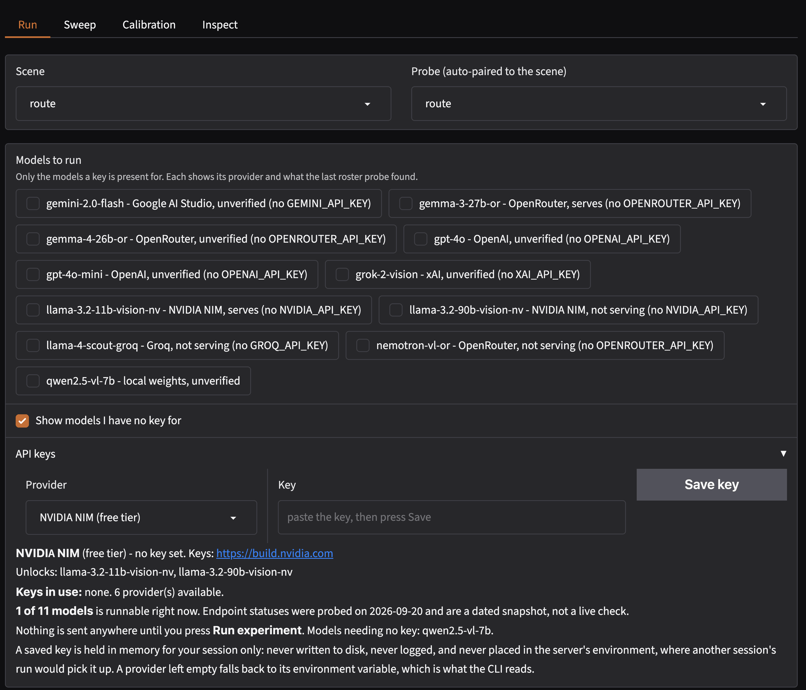
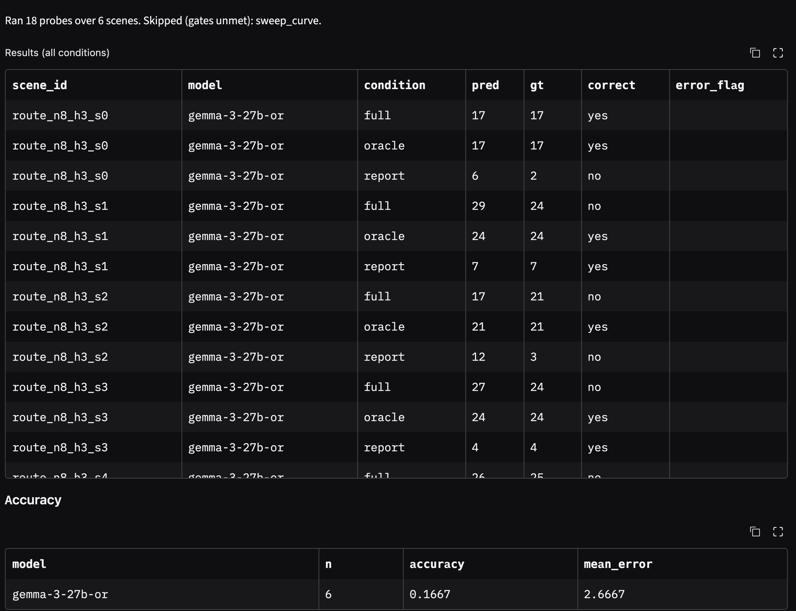

# RenderProbe

**Decomposing why an Vision Language Model fails**

RenderProbe lets users render scenes with computeable ground truth, and then separates VLM failures into three categories to determine: 
if the model could not *see* the fact, could not *use* the fact, or could not *reason* with it even when handed the perceptual facts.



Everything a run needs is on one screen: the scene and the models to put it to, the dials
that set its difficulty, and the exact picture, question and ground truth that will be
sent. Nothing is called until you press Run.

---




On the road map, gemma-3-27b reads the numbers off the picture five times out of six
(`report` 0.83) and then fails to route on them (`full` 0.33). Even after suceeding at the perception stage, it it is failing at the downstream task. However, on the polycube task, it is unable to recover the target's shape (`report` 0.00), and no amount of reasoning can  rescue a misread fact.

These are different problems with different fixes, and a single accuracy benchmark cannot tell them apart.

### Parametric control for adjusting difficulty



The road map's two difficulties are on separate controls. `n_towns` sets how hard the map
is to read; `n_hops` sets how long the cheapest route is. Above, the map stays equally hard to read and only the route gets longer. 

---

## For Example

<table>
<tr>
<td width="50%"></td>
<td width="50%"></td>
</tr>
<tr>
<td><b>route</b> - what is the total length of the cheapest route from H to F?</td>
<td><b>polycube</b> - the gray piece is the target; which colored candidate is it?</td>
</tr>
</table>

**route** is a weighted planar graph drawn as a road map. The answer is an integer, so
guessing is worth about 5% rather than the 50% at a yes/no question. Every map incldes variance, such that the cheapest road leaving the start town is *not* the first road of the answer, which is what stops a model walking greedily and never comparing whole
routes. On the map above, the cheap-looking `H-C` road (4) leads into a detour costing 49
against a true answer of 24. Roads never cross, because an intersection comes across as genuinely ambiguous
in a picture.

**polycube** partitions a 3x3x3 cube into interlocking pieces, then shows one of them
again on its own, rotated and in neutral gray. Counting cubes and comparing bounding
boxes are both ruled out by construction: across 24 seeds, neither measurement, nor both
together, identifies the coorect answer.

Both are generated procedurally. 

A third scene, `gear_train`, lives outside the package as the worked extensibility example, to show the users how to onramp their own scenes in into the framework. It
is calibrated the same way and is the subject of [`docs/on_ramp.md`](docs/on_ramp.md).

---

## How the decomposition works

Every scene is asked three ways.

| condition | what the model gets | what it isolates |
| --- | --- | --- |
| `full` | the image and the question | the whole task |
| `oracle` | the same question with the facts written out as text, no image | reasoning alone |
| `report` | the image and one direct perceptual sub-question | perception alone |

`recovery = acc_oracle - acc_full` bounds how much of the failure lies in the visual pathway. The `report` condition splits that bound: if the model can state the perceptual facts but still fails the task, the fault is downstream of perception.


**The oracle is proved complete.** A probe ships a reference reasoner that re-derives the answer from only the facts the oracle states. `renderprobe validate` runs it across seeds, and a probe whose oracle text
is missing something fails there. For `route` the reference reasoner is Dijkstra; for `polycube` it is congruence over the rotation group.

**The verdict reports its own confidence.** The bottleneck label comes out of an ordered
threshold cascade, which is a step function, so a point estimate sitting near a cutoff can
flip on a single item. A label below 95% agreement is
printed as unsettled. In the figure above, one verdict is firm and one is not.

Full write-up, with the literature it builds on: [`docs/methodology.md`](docs/methodology.md).


---

## Install

```bash
python -m venv .venv && source .venv/bin/activate
pip install -e '.[dev,ui,models]'
pip install -e '.[render3d-cpu]'    # Mitsuba, for the 3D scenes
```

`render3d-cpu` is a headless CPU path tracer. 

## Try it without an API key

The whole test suite, every analyzer, the validator and the UI run offline. The scenes
and model doubles that make that possible live in `tests/fixtures/`, outside the
installed package, so they can never be mistaken for part of the instrument.

```bash
pytest                                  # 576 tests, no network
renderprobe list                        # what is registered
renderprobe ui                          # http://localhost:7860
```

The UI has a live scene preview showing the exact question and ground truth a model would
receive, so you can judge a scene before spending anything on it.



The preview is the input itself: the picture, the question worded as the model receives it,
and the ground truth the answer will be scored against, for the first seed in the list.

The `mock*` doubles are **not models** and are not installed. They exist to exercise the
plumbing offline, and they live with the fixture scenes they were written against. No
number in this README comes from one.

## Run it against a real model

From the shell, for a scripted run:

```bash
export NVIDIA_API_KEY=...        # build.nvidia.com, free tier
export OPENROUTER_API_KEY=...    # openrouter.ai, free tier
renderprobe run configs/route.yaml
```

Or from the UI, which is the quicker way to put one model on one scene:



Every model is listed with its provider, the variable it reads and what the last roster
probe found, so an endpoint that is not serving is visible before it costs anything. A key
pasted here is held for that browser session only.



Six seeds of `route` put to gemma-3-27b-or, each scene asked all three ways. The `full` and
`oracle` rows of one scene are the paired observations `recovery` is measured from.


---

## Writing your own scene

```bash
renderprobe new scene my_task           # what the model is shown
renderprobe new probe my_task_probe     # what it is asked about it
renderprobe validate .                  # the honesty battery
```

Scaffold both: the scene is pixels and a ground truth, and the probe carries the question, the oracle and the perception report, which is where nearly everything here
comes from. 

There is a worked example: [`docs/on_ramp.md`](docs/on_ramp.md) builds [`examples/gear_train.py`](examples/gear_train.py) from nothing, a single file loaded from
outside the package.


`validate` tries to catch the ways a synthetic benchmark could fail:

- **determinism** - same seed, same ground truth and same scene graph.
- **occlusion safety** - for a 3D scene, it renders an object-index pass and certifies
  that every object the answer depends on is still visible. A scene whose ground truth
  cannot be recovered from its own pixels is flagged here.
- **oracle completeness** - the reference reasoner above, across seeds.
- **answer balance** - a dominant answer across seeds means a model can score without
  looking, and that fails too.
- **perception report** - checks the sub-question is answerable and that exactly one
  report drives the encoding/grounding split.

Then, before you spend anything:

```bash
python tools/calibrate.py route --model gemma-3-27b-or --scenes 6
```

```
  accuracy            2/6 = 0.33     chance   0.3/6 = 0.05
  P(>= observed | guessing)   0.030
  VERDICT: MEASURABLE. Accuracy is clear of chance and inside [0.2, 0.8].
```

Six calls to learn whether a scene can be measured at all. 

Long runs can be resumed:

```bash
python tools/run_experiment.py configs/route.yaml
```

---

## Architecture

 [`core/schema.py`](src/renderprobe/core/schema.py) holds the data classes
and the plugin protocols and has zero internal imports. Post-freeze changes are additive and are logged in that file.

```
SceneGenerator -> Scene (images + ground_truth + factors + optional SceneGraph)
         Probe -> question / parse / score / oracle_prompt / perception_report
      Renderer -> render(graph) -> images, and optionally render_ids for occlusion proofs
  ModelAdapter -> run(images, prompt) -> Response
      Analyzer -> analyze(list[Result]) -> AnalysisReport
```

Every plugin call is sandboxed into a structured `error_flag` on the row, so one bad
plugin cannot take down a run. Analyzers declare what they need and are skipped with a
printed reason rather than failing when it is absent.

| layer | what is there |
| --- | --- |
| scenes | `route` and `polycube` ship; `gear_train` is the out-of-tree example. The offline fixtures live in `tests/fixtures/` |
| probes | one per scene family, each carrying its own oracle and perception report |
| renderers | `pil_2d`, `pil_25d`, `mitsuba_3d` (CPU path tracer), `pyrender_3d` (GPU) |
| analysis | `decomposition`, `oracle`, `accuracy`, `sweep_curve`, `taxonomy`, `calibration`, `visual_gain` |
| tools | `calibrate.py` (is a scene measurable), `run_experiment.py` (resumable runs), `check_features.py` (every UI feature against every scene). Development aids, outside the package |

```bash
ruff check src/ tests/ tools/
pytest
```

---

## License

MIT. See [`LICENSE`](LICENSE). Use it, fork it, build on it; keep the copyright notice.
