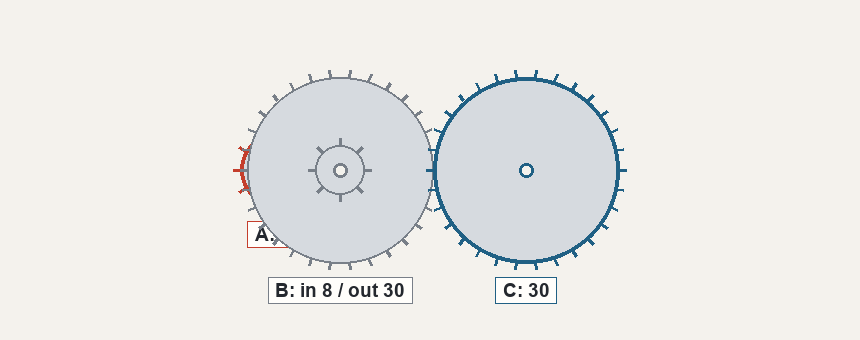

# Adding your own scene

This is a tutorial on how to include your own scene onto the RenderProbe framework, and includes two points where it was wrong and had to change. The finished code is
[`examples/gear_train.py`](../examples/gear_train.py), just over 300 lines.

In short, you need to:

```bash
renderprobe new scene my_task            # what the model is shown
renderprobe new probe my_task_probe      # what it is asked about it
renderprobe validate .                   # is the question well posed?
python tools/calibrate.py my_task ...    # is it measurable at all?
renderprobe run my_config.yaml --plugin-dir .
```

**Scaffold both.** A scene is pixels and a ground truth; a probe is the question, the
oracle, and the perception report. Almost everything this tool does lives on the probe,
so a scene on its own validates only that it draws and is deterministic, and skips every
check of the answer. The two templates are written to fit each other as generated, so
you can validate and run the pair before editing either one and see every condition and
every tab populated first.

`validate` runs offline and is free. `calibrate` costs six model calls.

---

## The task



Gears sit on a row of shafts, meshing left to right, each labeled with its tooth count.
Where two gears share a shaft they are bolted together and turn as one. The first shaft
is turned a given number of times and the question asks how many turns the last shaft makes.

Above: shaft A is turned 10 times, and the answer is 15.

I picked it because its two difficulties are on separate controls, which is the property that decides whether a scene can be measured at all. 

---

## Step 1: scaffold

```bash
renderprobe new scene gear_train --dir examples
renderprobe new probe gear_train --dir examples
```

Each writes a template with the contract already in place and comments explaining what
every method is for and what it buys you. Fill them in.

An out-of-tree module is imported by path, not as part of a . package, so it cannot import its neighbors. Put the scene and the probe in the same file
and export both:

```python
PLUGINS = [_GearTrainScene(), _GearTrainProbe()]
```

The registry sorts them out by which protocol each satisfies. A single `PLUGIN` works too
when there is only one.

## Step 2: the scene

A scene generator has one job: given parameters and a seed, return a `Scene` holding
images, ground truth, and the factors an analyzer can sweep over.

Three things in this one are worth copying.

**Compute the ground truth.** The answer comes from the same function the images are drawn from:

```python
def turns_of(shafts, driver_turns):
    turns = float(driver_turns)
    for i in range(len(shafts) - 1):
        driving = shafts[i][1] or shafts[i][0]
        turns = turns * driving / shafts[i + 1][0]
    return turns
```

Everything from the ground truth to the oracle solver
depends on it.

 Generation runs in a retry loop and throws
away anything that would make a bad question. Here the answer must be a whole number, so
`score` can be a plain equality instead of a tolerance, and the wrong answer the task is
designed to catch must not coincide with the right one:

```python
if naive == value and stages > 1:
    continue    # the trap is invisible; this scene teaches nothing
```

If nothing survives the retries, raise with a message that says what to change. Do not
emit a degraded scene.

**Name the wrong answer you expect.** In a plain row of gears, every gear between the
ends is an idler: the ratio telescopes and only the first and last tooth counts matter.
A compound shaft breaks that, and a model reaching for the familiar shortcut lands on a
specific number. It is stored:

```python
"simple_train_answer": int(naive),
```

Now a run can separate *that mistake* from noise, which is far more informative than a
bare wrong-answer count.

## Step 3: the probe

`renderprobe new probe` scaffolds this one, with every method below already stubbed and
commented. The probe turns a scene into the three conditions the decomposition needs.

| method | required | what it unlocks |
| --- | --- | --- |
| `question`, `parse`, `score` | yes | the task itself; Accuracy, Taxonomy, Inspect |
| `oracle_prompt` | no | the `oracle` condition, and with it `recovery` and the Oracle tab |
| `oracle_solver` | no | the oracle-completeness certificate in `validate` |
| `perception_report` | no | the `report` condition, and with it the encoding/grounding split |
| `chance_level` | no | the chance line in `tools/calibrate.py` |

Everything but the first row is optional and discovered with `getattr`, so a probe that
stops after `score` is valid and simply produces less. Moreover, without `oracle_prompt` there is no `recovery`, and without `perception_report` a failure cannot be split into seeing and using.

**`oracle_solver` ** It re-derives the answer from what the oracle prompt states:

```python
def oracle_solver(self, scene):
    gt = scene.ground_truth
    shafts = [(int(a), int(b) if b is not None else None) for a, b in gt["shafts"]]
    value = turns_of(shafts, int(gt["driver_turns"]))
    return int(value) if value == int(value) else None
```

`validate` runs it across seeds. If it agrees with ground truth every time, your oracle
text provably contains enough to answer, so a model failing under the oracle failed at reasoning rather than for want of a fact. 

**The report asks for a primitive the task consumes.** 

> In the picture, shaft A carries the gear drawn in red. How many teeth does its LARGEST
> gear have? Answer with a single number.

If a model can answer this and still fails the
task, the fault is downstream of perception, a  split the three-way decomposition reports.


## Step 4: validate

```bash
renderprobe validate examples/gear_train.py --seeds 12
```

```
[scene] gear_train  ->  OK
  PASS  determinism       same seed -> identical scene across seeds 0-2
  PASS  probe-pairing     paired with probe 'gear_train'
  PASS  gt-roundtrip      the ground-truth answer scores correct
  PASS  perception-report  VALID (primary -> feeds acc_report); asked over the unmodified image
  PASS  oracle-completeness  a reference reasoner re-derives GT from the stated facts on 12/12 scenes
  PASS  answer-balance    10 distinct answers over 12 seeds (most common 17%)

2 plugin(s): 2 clean, 0 with warnings, 0 failing.
```

It is trying to catch the ways a synthetic benchmark could false report: an answer that barely moves across seeds, an oracle missing a fact it needs, a scene
whose ground truth cannot be recovered from its own pixels. For a 3D scene it also renders an object-index pass and certifies that nothing the answer depends on is hidden.

Passing this means the question is **well posed**. It says nothing about whether it can be measured.

---

## Step 5: calibrate

```bash
python tools/calibrate.py gear_train --plugin-dir examples \
    --model gemma-3-27b-or --scenes 6
```

```
  accuracy            6/6 = 1.00
  chance              1.3/6 = 0.22
  VERDICT: AT CEILING. The model solves this.
```

The first version was a plain row of gears: no compound shafts, one division to do. It passed validate cleanly and the model got every single one right. There is no failure to localize in a task a model simply solves, so a full run would have bought nothing.

Adding more gears (`n_gears` 4 to 6)
is pure perception load, and reading labels turns out to be easy: still 6/6. **A parameter that
does not move accuracy is not a difficulty parameter.**

However, bolting a second gear to the middle shaft makes
the stage ratios multiply instead of telescoping, so the first-over-last shortcut stops being correct. Re-gated:

| `n_stages` | what it is | verdict |
| --- | --- | --- |
| 1 | plain train, one division | **AT CEILING** (6/6) |
| 2 | one compound shaft | **MEASURABLE** (2/6, chance 0.08, P = 0.069) |
| 3 | two compound shafts | **AT FLOOR** (1/6, P = 0.350) |


**Chance is computed per scene,.** A scene admitting 11 plausible answers and one admitting 20 have different floors, and their mean misstates both. The tool sums them
as a Poisson-binomial and reports the probability that guessing produces at least what you
observed.

## Step 6: run it

```yaml
# configs/gear_train.yaml
experiment: gear_train
plugin_dirs:
  - examples
scene:
  generator: gear_train
  params:
    n_stages: [1, 2, 3]
  seeds: [0, 1, 2, 3, 4, 5]
probe: gear_train
models: [gemma-3-27b-or, llama-3.2-11b-vision-nv]
analysis: [accuracy, decomposition, oracle, sweep_curve, taxonomy]
```

```bash
renderprobe run configs/gear_train.yaml
python tools/run_experiment.py configs/gear_train.yaml   # resumable
```

### Turning the rest of the UI on

That config leaves two tabs dark for cost reasons. Every
analyzer declares what it needs and is skipped with a printed reason when it is missing, so an empty tab always traces back to an input you did not ask for:

| tab | needs | how you ask for it |
| --- | --- | --- |
| Accuracy, Taxonomy, Inspect | nothing beyond `full` | always on |
| Oracle | the probe's `oracle_prompt` | `analysis: [oracle]` |
| Decomposition | `oracle_prompt` and `perception_report` | `analysis: [decomposition]` |
| Sweep | a parameter given as a list | `params: {n_stages: [1, 2, 3]}` |
| Calibration | a stated confidence on every answer | `elicit_confidence: true` |
| Visual gain | the same question with no image | `blind: true` |

The last two are off in every shipped config on purpose. `blind: true` doubles the number
of calls, and `elicit_confidence: true` appends a sentence to every prompt. Leaving them off is what keeps the numbers in the README the product of the plainest prompt there is. Turn them on when you want those two tabs.

The second form caches every reply as it arrives, keyed by model, prompt and image bytes,
so a run killed part way finishes for the cost of what is left rather than starting over.
It caches the generated scenes too, which is what makes that true for a scene rendered by
a stochastic renderer: without it the pixels differ on every run, so every key misses and
nothing resumes. `--fresh` discards both.

---

## take aways

`validate` asks whether the question is well
posed and  `calibrate` asks whether a model sits somewhere the answer is informative, and costs six calls.

 If one difficulty parameter drives both how
hard the scene is to see and how hard it is to work out, you cannot position it. Write down which knob does which, then check the claim: `n_gears` turned out to move nothing at all.
